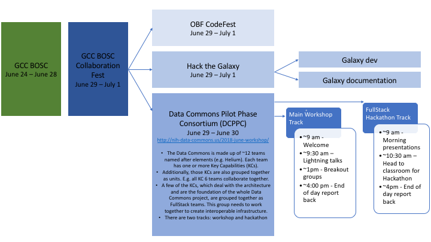

### Concurrent Collaboration Fest, DCPPC Workshops, and DCPPC Hackathon

[Collaboration Fest](https://galaxyproject.org/events/gccbosc2018/collaboration/) includes multiple tracks including the Data Commons Pilot Phase Consortium (DCPPC), OpenBio Codefest (OBF), Galaxy development, and Galaxy documentation, analysis, and training (DAT). We will be sharing spaces will all these events and you are encouraged to network!

The DCPPC will have two concurrent tracks: main workshop and full stack hackathon. Both groups will meet in the auditorium (room TBD) for the welcome and end of day recaps. Check out this infographic from Sarah Davis for an overview. A detailed schedule is below. 

### Rooms

The event will take place in the Performing Arts Building at Reed College.

- All talks will take place in **PAB 320**.
- The full stack hackathon will take place in **PAB 131** 
- Breakout groups will be disperses in the atrium.

### Workshop Day 1: June 29, 2018

**Link to connect via Zoom: [https://zoom.us/j/949707843](https://zoom.us/j/949707843)**

09:00 - Welcome remarks: Rayna Harris (Team Copper) and Simon Twigger (NIH)
 
09:30 - Lightning talks: The awesome things your team has accomplished already.

_To view the speaker order and to indicate who will represent your team, please visit [this issue](https://github.com/dcppc/2018-june-workshop/issues/4). Each speaker will have 5 minutes to present and 3 minutes for Q&A._
  
10:30 - Coffee break (~20 minutes)
 
12:00 - Lunch (1 hour)         

13:00 - Breakout group planning

_For up-to-date information on breakout sessions, please visit the [June Workshop issues page](https://github.com/dcppc/2018-june-workshop/issues)_

13:30 - Breakout session 1

14:30 - Coffee break (~20 minutes)

14:50 - Breakout session 2

16:00 - Breakout session 1 and 2 recap 

16:30 - End

### Workshop Day 2: June 30, 2018

**Link to connect via Zoom: [https://zoom.us/j/949707843](https://zoom.us/j/949707843)**

 09:00: Welcome remarks: S. Edrie (Team Copper)
 
 09:20: Lightning talks: The awesome things your team will accomplish in the future.

_To view the speaker order and to indicate who will represent your team, please visit [this issue](https://github.com/dcppc/2018-june-workshop/issues/5). Each speaker will have 5 minutes to present and 3 minutes for Q&A._

10:30 - Coffee break (~20 minutes)
 
12:00 - Lunch (1 hour)         

13:00 - Breakout group planning

_For up-to-date information on breakout sessions, please visit the [June Workshop issues page](https://github.com/dcppc/2018-june-workshop/issues)_

13:30 - Breakout session 3

14:30 - Coffee break (~20 minutes)

14:50 - Breakout session 4

16:00 - Breakout session 3 and 4 recap 

16:10 - Post-workshop survey
 
16:20 - Closing remarks

16:30 - End
 

### Hackathon 

**Link to connect  via Zoom: [https://renci.zoom.us/j/313849638](https://renci.zoom.us/j/313849638)**

_Hackers should plan on attending the Workshop Welcome each morning at 9 am. We can play it by ear how many of the Lightning Talks to attend. At the end of each day, hackers should be prepared to give a very brief update on what was accomplished in the hackathon._

The hackathon will focus on three themes:

1. **Workflows:** Creating reusable validations tools to assess whether or not different implementations of a workflow are producing the expected results.
2. **DOS+BDBags:** What is the relationship between the DOS API and BDBags as interoperable data access and exchange standards?
3. **Auth:** Working implementations of REST APIs supporting the OAuth/OIDC federation model.
 
_For up-to-date information about hackathon topics, please visit the [Full Stacks issues page](https://github.com/dcppc/full-stacks/issues)_ 

