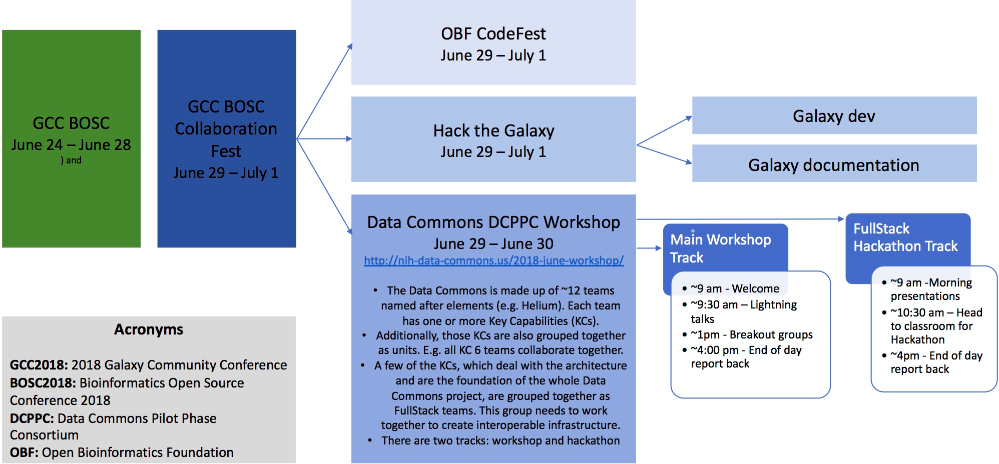

The 2018 June DCPPC workshop will take place 
on **June 29-30 in Portland, Oregon** 
concurrent with the [GCC BOSC 2018 Conference](https://gccbosc2018.sched.com/). 
Both GCC BOSC and the DCPPC Workshop will be held at 
[Reed College](http://www.reed.edu/)
in Portland.

## Concurrent Collaboration Fest, DCPPC Workshops, and DCPPC Hackathon

[Collaboration Fest](https://galaxyproject.org/events/gccbosc2018/collaboration/) includes multiple tracks including the Data Commons Pilot Phase Consortium (DCPPC), OpenBio Codefest (OBF), Galaxy development, and Galaxy documentation, analysis, and training (DAT). We will be sharing spaces will all these events and you are encouraged to network!

Additionally, the DCPPC will have two concurrent tracks: main workshop and hackathon. Team Copper is planning the monthly meeting and Teams Helium, Argon, Calcium, and Xenon are planning a 2-day hackathon. These events will run concurrently. To maximize the efficacy of both events, all participants will come together at the welcome remarks, end of the day recaps, closing remarks, coffee breaks, and lunch as described in the workshop schedule below. Then, attendees can split off into whatever is most useful for them and for the DCPPC (hackathon only, hackathon in lieu of the breakout sessions, workshop only). 

Check out this infographic from Sarah Davis for an overview. 

## Workshop Day 1: June 29, 2018

Link to connect via Zoom: https://zoom.us/j/949707843

09:00 - Welcome remarks - Rayna Harris and S. Edrie 
 
09:30 - Lightning talks: The awesome things you _have accomplished in the past_.

- Argon:
- Calcium: 
- Carbon: 
- Copper: 
- Data Stewards (AGR):
- Data Stewards (GTEx): 
- Data Stewards (TOPMed):
- Helium: 
- Hydrogen (NIH): 
- Nitrogen: 
- Oxygen: 
- Phosphorus: 
- Sodium: 
- Xenon: 
  
10:30 - Coffee break (~20 minutes)
 
12:00 -  Lunch (1 hour)         

13:00 -  Breakout group planning

_For up-to-date information on breakout sessions, please visit the [June Workshop issues page](https://github.com/dcppc/2018-june-workshop/issues)_

13:30 -  Breakout session 1

14:30 - Coffee break (~20 minutes)

14:50 -  Breakout session 2

16:00 - Breakout session 1 and 2 recap 

16:30 - End

## Workshop Day 2: June 30, 2018

Link to connect via Zoom: https://zoom.us/j/949707843

 09:00: Welcome remarks:  S. Edrie 
 
 09:20: Lightning talks: The awesome things you _hope to accomplish in the future_.

- Xenon:
- Sodium: 
- Phosphorus: 
- Oxygen: 
- Nitrogen: 
- Hydrogen (NIH): 
- Helium: 
- Data Stewards (TOPMed):
- Data Stewards (GTEx): 
- Data Stewards (AGR):
- Copper:
- Carbon:
- Calcium: 
- Argon:

10:30 - Coffee break (~20 minutes)
 
12:00 -  Lunch (1 hour)         

13:00 -  Breakout group planning

_For up-to-date information on breakout sessions, please visit the [June Workshop issues page](https://github.com/dcppc/2018-june-workshop/issues)_

13:30 -  Breakout session 3

14:30 - Coffee break (~20 minutes)

14:50 -  Breakout session 4

16:00 - Breakout session 1 and 2 recap 

16:10 - Post-workshop survey
 
16:20 - Closing remarks

16:30 - End
 

## Hackathon 

Link to connect  via Zoom: https://renci.zoom.us/j/313849638

The hackathon will focus on three themes:

1. **Workflows:** Creating reusable validations tools to assess whether or not different implementations of a workflow producing the expected results.
2. **DOS+BDBags:** What is the relationship between the DOS API and BDBags as interoperable data access and exchange standards?
3. **Auth:** Working implementations of REST APIs supporting the OAuth/OIDC federation model.
 
_For up-to-date information about hackathon topics, please visit the [Full Stacks issues page](https://github.com/dcppc/full-stacks/issues)_ 

